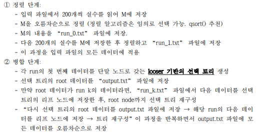

# Selection Tree
#Data/Selection Tree

---



```c
//(1)
#include <stdio.h>
#include <stdlib.h>
int compare(const void* com1, const void* com2);
void ArrayInit(double* arr);

int main(){
	char f[50];
	FILE *input;
	double M[200];
	double d;
	int cnt = 0;
	int fcnt = 0;
	FILE * wrun;
	char name[50];

	printf("File name? ");
	scanf_s("%s", f, 50);
	
	ArrayInit(M);
	
	fopen_s(&input, f, "r");
	if (input == NULL)
	{
		printf("There's no file. Exit the program\n");
		return 0;
	}

	while (EOF!= fscanf_s(input, "%lf", &d)) {
		M[cnt++] = d;

		if (cnt == 200) {
			qsort(M, 200, sizeof(double), compare);

			sprintf_s(name, "run_%d.txt", fcnt);
			fopen_s(&wrun, name, "w");

			for (int i = 0; i < 200; i++)
				fprintf(wrun, "%lf\n", M[i]);
			cnt = 0;
			ArrayInit(M);
			fcnt++;
			fclose(wrun);
		}
		
	}

	fclose(input);
	if (M[0] != 0) {
		qsort(M, 200, sizeof(double), compare);

		sprintf_s(name, "run_%d.txt", fcnt);
		fopen_s(&wrun, name, "w");

		for (int i = 0; M[i] != 2.000000; i++)
			fprintf(wrun, "%lf\n", M[i]);
		fcnt++;
		fclose(wrun);
	}
	
	FILE* rrun;
	fopen_s(&rrun, "run_0.txt", "r");
	if (input == NULL)
	{
		printf("There's no file. Exit the program\n");
		return 0;
	}

	fopen_s(&wrun, "output.txt", "w");
	while (EOF != fscanf_s(rrun, "%lf", &d)) {
		fprintf(wrun, "%lf\n", d);
	}
	fclose(wrun);
	fclose(rrun);

	for (int i = fcnt-1; i >= 0; i--)
	{
		sprintf_s(name, "run_%d.txt", i);
		remove(name);
	}

	return 0;
}

int compare(const void* com1, const void* com2) {
	double val1 = *(double*)com1;
	double val2 = *(double*)com2;

	if (val1 < val2)
		return -1;
	else if (val1 > val2)
		return 1;

	return 0;
}

void ArrayInit(double *arr) {
	for (int i = 0; i < 200; i++)
		arr[i] = 2.0000000;
}

```