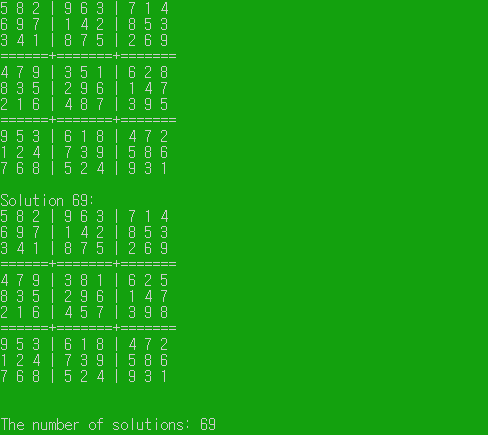

# 스도쿠
#etc/스도쿠

---

## 스도쿠(백트래킹 이용)




```c++
#include <stdio.h>

void setZarr();
void show();
void beforeSdoku();
int oneCheck(int row, int col);
void sdoku(int idx);
void change(int row, int col, int val, int t);
void changeBack(int row, int col, int val, int t);

int arr[9][9] = {};		// 9x9 스도쿠 배열
int zarr[90][2] = {};	// 0값 들어있는 배열 row, col
int rchk[9][10] = {};	// row 검사하는 배열
int cchk[9][10] = {};	// col 검사하는 배열
int tchk[9][10] = {};	// 영역 검사하는 배열
int count = 0;			// 0 개수
int sol = 1;			// 해답 Count

int main(void)
{
	int n, row, col, t;
	char f[50];
	FILE *input;

	printf("File name? ");
	scanf_s("%s", f, 50);

	fopen_s(&input , f, "r");
	if (input == NULL)
	{
		printf("There's no file. Exit the program\n");
		return 0;
	}

	fscanf_s(input, "%d", &n);	//데이터 개수 get

	for (int i = 0; i < n; i++)
	{
		fscanf_s(input, "%d %d", &row, &col);	// 행, 열 get
		fscanf_s(input, "%d", &arr[row][col]);	// 값 get
		rchk[row][arr[row][col]] = 1;	//행 검사 값 채우기
		cchk[col][arr[row][col]] = 1;	//열 검사 값 채우기
		t = 3 * (row / 3) + (col / 3);			//행, 열에 따른 t번째 영역
		tchk[t][arr[row][col]] = 1;		//영역 검사 값 채우기
	}
	fclose(input);

	setZarr();

	printf("Problem Show:\n");
	show();

	beforeSdoku();
	printf("As a result of allocating a value to a cell with one candidate value:\n");
	show();

	count = 0;
	setZarr();

	sdoku(0);
	printf("\nThe number of solutions: %d\n", sol - 1);
	
	return 0;
}

/*
 * 0배열 셋팅
 */
void setZarr() {
	for (int i = 0; i < 9; i++)
	{
		for (int j = 0; j < 9; j++)
		{
			if (arr[i][j] == 0)
			{
				zarr[count][0] = i;
				zarr[count][1] = j;
				count++;
			}
		}
	}
}

/*
 * 후보값이 하나인거 채우기
 */
void beforeSdoku() {

	int r, c, v, t;

	for (int i = 0; i < count; i++)
	{
		r = zarr[i][0];
		c = zarr[i][1];
		if (arr[r][c] == 0)
		{
			t = 3 * (r / 3) + (c / 3);
			v = oneCheck(r, c);
			if (v)
			{
				change(r, c, v, t);
				i = 0;
			}
		}
	}
}

/*
 * 후보값이 하나인지 검사
 */
int oneCheck(int row, int col) {
	int c = 0;
	int val = 0;
	int t = 3 * (row / 3) + (col / 3);
	for (int i = 1; i <= 9; i++)
	{
		if (!rchk[row][i] && !cchk[col][i] && !tchk[t][i])
		{
			c++;
			val = i;
		}

		if (c > 1)
			return false;
	}
	return val;
}

/*
 * 스도쿠 출력
 */
void show() {

	for (int i = 0; i < 9; i++)
	{
		if (i % 3 == 0 && i != 0)
			printf("======+=======+=======\n");

		for (int j = 0; j < 9; j++)
		{
			if (j % 3 == 0 && j != 0)
				printf("| ");

			if (arr[i][j] == 0)
				printf("- ");
			else
				printf("%d ", arr[i][j]);
		}
		printf("\n");
	}

	printf("\n");
}

/*
 * 해답
 */
void sdoku(int idx) {

	int t;
	int row = zarr[idx][0];
	int col = zarr[idx][1];
	t = 3 * (row / 3) + (col / 3);	//row, col에 따른 t번째 영역
	for (int val = 1; val <= 9; val++)
	{
		if (!rchk[row][val] && !cchk[col][val] && !tchk[t][val])		//rchk 행 검사, cchk 열 검사, tchk 영역검사
		{
			change(row, col, val, t);
			if (idx + 1 == count) {
				printf("Solution %d:\n", sol++);
				show();
			}
			sdoku(idx + 1);
			//다시 돌아왔으면 0으로 format
			changeBack(row, col, val, t);

		}

	}
}

/*
 * 영역 검사후 set
 */
void change(int row, int col, int val, int t) {
	rchk[row][val] = 1;
	cchk[col][val] = 1;
	tchk[t][val] = 1;
	arr[row][col] = val;
}

/*
 * 바꾼거 다시 reset
 */
void changeBack(int row, int col, int val, int t) {
	arr[row][col] = 0;
	rchk[row][val] = 0;
	cchk[col][val] = 0;
	tchk[t][val] = 0;
}

```