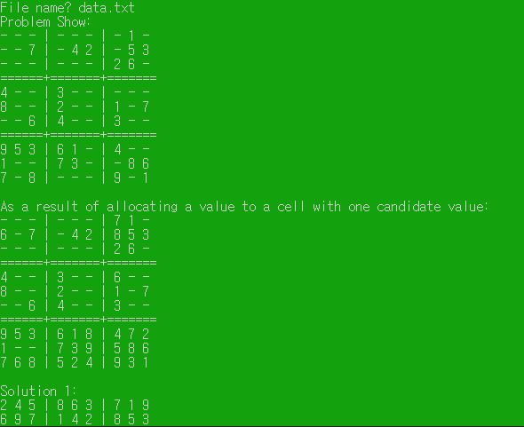

# 스도쿠
#etc/스도쿠

---

## 스도쿠(백트래킹 이용)



```c++
#include <stdio.h>

void show();
void sdoku(int idx);
void change(int row, int col,int val,int t);
void change_back(int row, int col,int val,int t);

int arr[9][9] = {};		// 9x9 스도쿠 배열
int zarr[90][2] = {};	// 0값 들어있는 배열 row, col
int rchk[9][10] ={};	// row 검사하는 배열
int cchk[9][10] = {};	// col 검사하는 배열
int tchk[9][10] = {};	// 영역 검사하는 배열
int count = 0;			// 0 개수

void main(void)
{
	int n, row, col, t;
	FILE *input;
	input = fopen("data.txt", "r");

	if(input == NULL)
	{
		printf("파일이 없습니다. 프로그램을 종료합니다.\n");
		return;
	}

	fscanf(input, "%d", &n);	//데이터 개수 get

	for(int i =0; i< n; i++)
	{
		fscanf(input, "%d %d", &row, &col);	// 행, 열 get
		fscanf(input, "%d", &arr[row][col]);	// 값 get
		rchk[row][arr[row][col]] = 1;	//행 검사 값 채우기
		cchk[col][arr[row][col]] = 1;	//열 검사 값 채우기
		t = 3*(row/3)+(col/3);			//행, 열에 따른 t번째 영역
		tchk[t][arr[row][col]] = 1;		//영역 검사 값 채우기
	}
	fclose(input);

	//0배열 채우기
	for(int i=0; i< 9; i++)
	{
		for(int j=0; j <9; j++)
		{
			if(arr[i][j] == 0)
			{
				zarr[count][0] = i;
				zarr[count][1] = j;
				count++;
			}
		}
	}

	printf("문제 행렬을 예쁘게 출력:\n");
	show();
	
	//TODO 개선(직관적인거 넣기)

	printf("해답:\n");
	sdoku(0);
	
}

void show(){

	for(int i= 0; i<9; i++)
	{
		if( i % 3 == 0 && i != 0)
			printf("========+=======+=======\n");

		for(int j =0;j<9;j++)
		{
			if(j % 3 ==0)
				printf("| ");

			if(arr[i][j] == 0)
				printf("- ");
			else
				printf("%d ", arr[i][j]);
		}
		printf("\n");
	}

	printf("\n");
}

void sdoku(int idx) {

	int t;
	int row = zarr[idx][0];
	int col = zarr[idx][1];
	t = 3*(row/3)+(col/3);	//row, col에 따른 t번째 영역
	for(int val = 1; val <= 9; val++)
	{
		if(!rchk[row][val] && !cchk[col][val] && !tchk[t][val])		//rchk 행 검사, cchk 열 검사, tchk 영역검사
		{
			change(row, col, val, t);
			if(idx+1==count){
				show();
				return;
			}
			sdoku(idx+1);
			//다시 돌아왔으면 0으로 format
			change_back(row, col,val, t);

		}

	}
}

void change(int row, int col,int val,int t){
	rchk[row][val] = 1;
	cchk[col][val] = 1;
	tchk[t][val] = 1;
	arr[row][col] = val;
}

void change_back(int row, int col, int val, int t){
	arr[row][col] = 0;
	rchk[row][val] = 0;
	cchk[col][val] = 0;
	tchk[t][val] = 0;
}

```