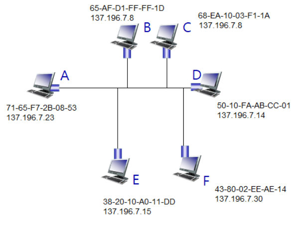
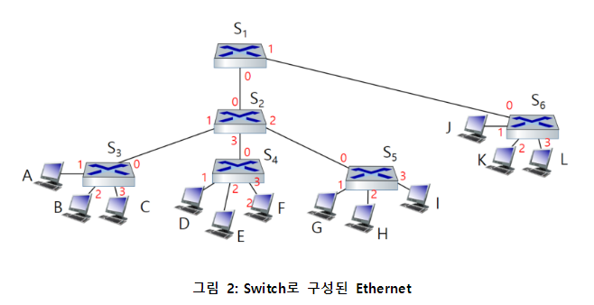

# assignment_1
#데이터통신/assignment

---
** 답은 12/7일 이후 추가

1 CSMA/CD 알고리즘에서 Collision이 발생할 때마다 random value를 뽑는 범위 (즉, contention window)를 증가시키는 이유를 설명하시오

2 CSMA/CD 프로토콜을 사용하는 이더넷 (Ethernet)에서 어떠한 노드가 7번의 Collision이 연속적으로 발생했다고 가정했을 시 해당 노드가 K값으로 7을 선택할 확률을 설명하시오

3 이더넷 (Ethernet)에서 데이터 프레임의 최소 크기를 제한하는 이유를 설명하시오

4.1. 그림 1과 같이 BUS 토폴로지 Ethernet 환경에 5개의 노드가 존재한다고 가정하자. 현재 모든 노드의 ARP 테이블을 비어있다. 노드 A가 노드 F에게 데이터 프레임을 전송하고자 할 때 실제 데이터 전송 전에 동작하는 ARP의 과정을 설명하시오 

그림 1: BUS 토폴로지로 구성된 Ethernet

4.2. 문제 4.1에서 설명한 ARP 수행이 종료된 후 노드 A의 ARP 테이블을 그리시오 (TTL 열은 생략)

5 그림2와 같이 스위치로 연결된 이더넷을 가정하자. 이때, 모든 스위치들의 초기 switch table은 비어있다. 노드 A가 노드 K에게 보낸 데이터 프레임이 노드 K에게 정상적으로 수신되었을 때, 다른 모든 스위치들 (S1~S6)의 switch table을 그리시오 (TTL 열은 생략)
- A가 보낸 데이터 프레임은 네트워크 내 모든 노드 (A~L)에게 정상적으로 도착한다고 가정
- 그림 내 숫자 (붉은 폰트)는 interface number를 의미

그림 2: Switch로 구성된 Ethernet